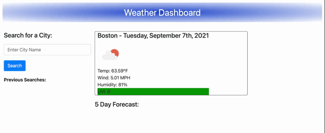

# 06 Server-Side APIs: Weather Dashboard

# Mock-Up

The following image shows the web application's appearance and functionality:

# HTML 
- I used the html to build the layout of the page 
- I used bootstrap to style some of the elements
- I liked all of my 3rd party API's

# CSS
- I used CSS to style the overall look of the page

# JS
- I used JS for the functionality of the page
- I used the weather API to pull real time weather info
- I used local storage to save the data to the browser 
- I used local storage to append previously searched cities to the page 

# Deployed Link